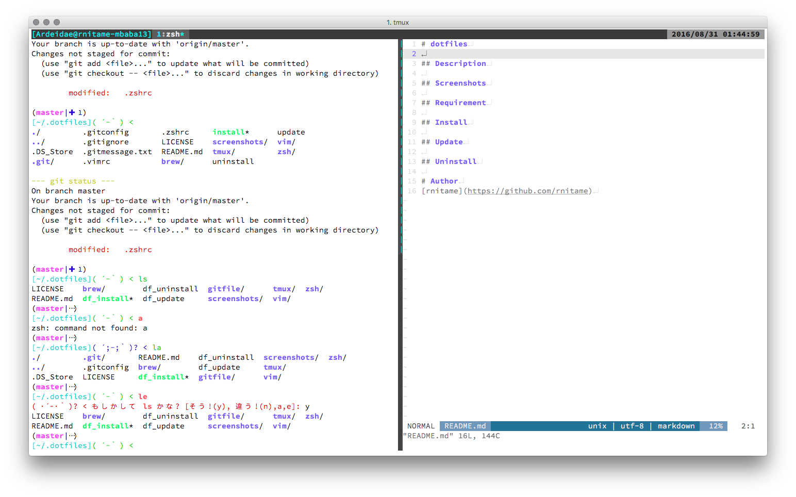
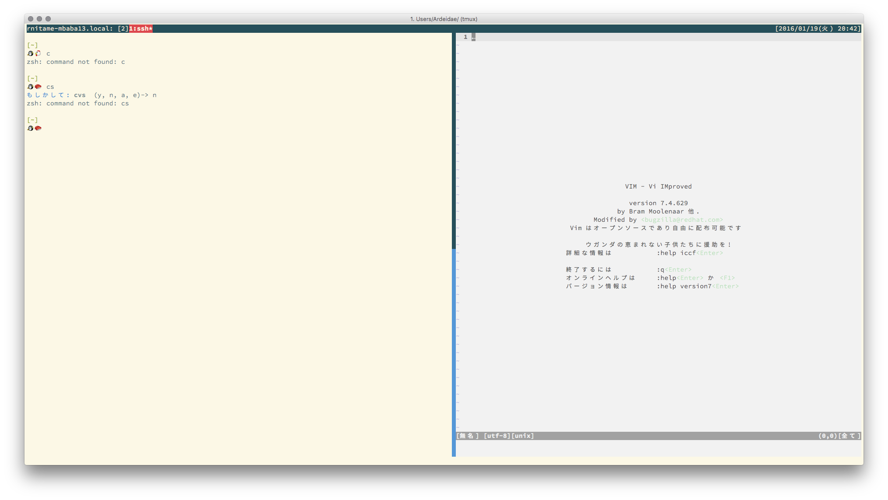

# dotfiles
File list

- install 
- uninstall
- .zshrc
- .zshenv
- .vimrc
- .tmux.conf
- Linux/
    - .zshrc_linux
- MacOSX/ 
    - Brewfile
- .gitconfig
- .gitignore
- .gitmessage.txt

# Install

```
$ git clone https://github.com/rnitame/dotfiles.git ~/.dotfiles
$ cd ~/.dotfiles
$ ./install 
```

# Uninstall

```
$ cd ~/.dotfiles 
$ ./uninstall 
$ rm -rf ~/.dotfiles 
```

# Screenshot
## Mac OSX

## Linux

## COMMIT_EDITMSG 


# Author
[rnitame](https://github.com/rnitame)
