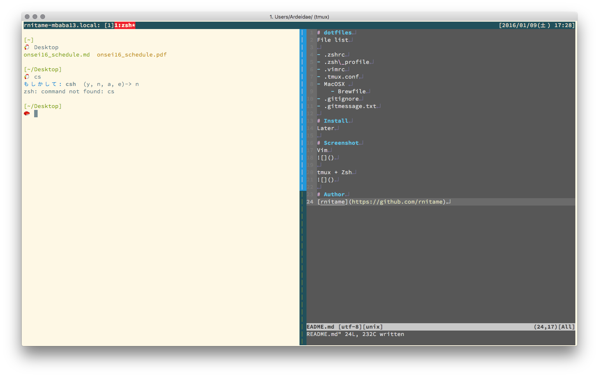

# dotfiles
File list

- .zshrc
- .zsh\_profile
- .vimrc
- .tmux.conf
- Linux/
    - .tmux_linux.conf
- MacOSX/ 
    - Brewfile
- .gitconfig
- .gitignore
- .gitmessage.txt

# Install

```
$ git clone git@github.com:rnitame/dotfiles.git ~/.dotfiles
$ cd ~/.dotfiles
$ ./setup
```

# Screenshot
## tmux, Zsh, Vim

## COMMIT_EDITMSG 


# Author
[rnitame](https://github.com/rnitame)
